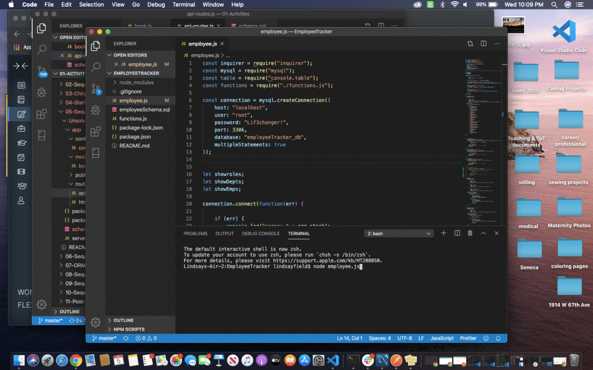

# EmployeeTracker
An application that allows a user to track employees by a unique id, role, salary, and department

## Usage and Installation
Run an npm install and use the app through the command line. 

## Demonstation
